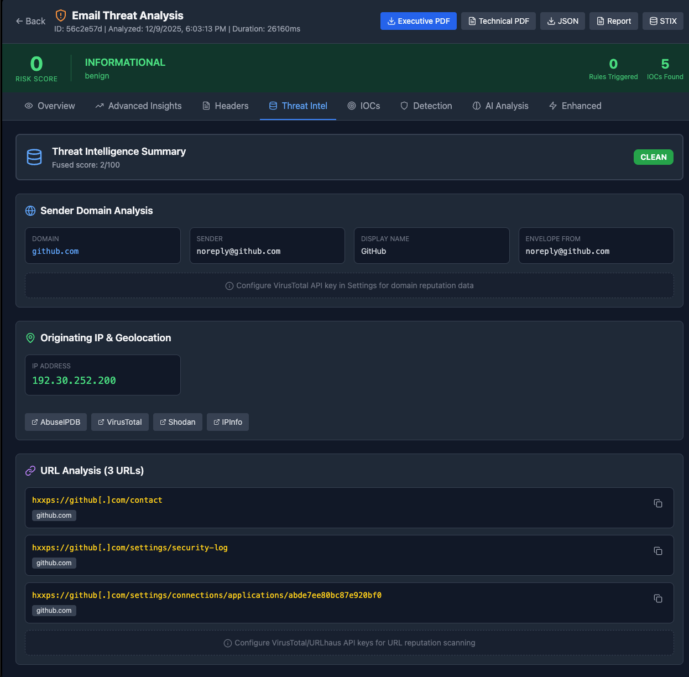

# 🛡️ NiksES - Email Security Analysis Platform

An AI-powered email security investigation tool designed for SOC analysts. Analyze suspicious emails with threat intelligence enrichment, detection rules, and AI-powered triage.
## 🌐 Live Demo

**Try it now:** [https://nikes-ui.up.railway.app](https://nikes-ui.up.railway.app)

---
[alt text](image.png)


## ✨ Features

### 🔍 Email Analysis
- Parse `.eml` and `.msg` email files
- Extract URLs, attachments, and IOCs automatically
- Analyze email headers and authentication (SPF, DKIM, DMARC)

### 🧠 AI-Powered Triage
- Automatic threat classification using OpenAI
- Social engineering detection
- Risk scoring with detailed explanations

### 🌐 Threat Intelligence
- **VirusTotal** - URL, domain, IP, and file reputation
- **AbuseIPDB** - IP abuse scoring
- **MXToolbox** - Blacklist checks
- **URLhaus** - Malicious URL database
- **WHOIS** - Domain age and registration data

### 🎯 Detection Engine
- 60+ built-in detection rules
- Custom rule creation (YARA-like syntax)
- MITRE ATT&CK mapping
- Categories: Phishing, BEC, Malware, Spoofing, Brand Impersonation

### 🛠️ SOC Tools
- IOC Quick Actions (copy, search in VT/AbuseIPDB)
- Incident Ticket Generator (ServiceNow, Jira, Markdown)
- Response Playbooks
- YARA/Sigma Rule Generator
- User Notification Templates
- PDF Report Export (Executive & Technical)

---

## 📸 Screenshots

### Main Analysis View
![Analysis View]

### Threat Intelligence


### AI Triage Results


### SOC Tools


---

## 🚀 Quick Start

### Prerequisites
- Python 3.11+
- Node.js 20+
- Docker (optional)

### Local Development

**Backend:**
```bash
cd backend
pip install -r requirements.txt
uvicorn app.main:app --reload --port 8000
```

**Frontend:**
```bash
cd frontend
npm install
npm run dev
```

### Environment Variables

| Variable | Description | Required |
|----------|-------------|----------|
| `OPENAI_API_KEY` | OpenAI API key for AI analysis | For AI features |
| `VIRUSTOTAL_API_KEY` | VirusTotal API key | Recommended |
| `ABUSEIPDB_API_KEY` | AbuseIPDB API key | Recommended |
| `MXTOOLBOX_API_KEY` | MXToolbox API key | Optional |
| `AI_ENABLED` | Enable AI features (`true`/`false`) | No |
| `AI_PROVIDER` | AI provider (`openai` or `anthropic`) | No |
| `CORS_ORIGINS` | Allowed CORS origins | For production |

---

## 🏗️ Tech Stack

| Layer | Technology |
|-------|------------|
| Frontend | React, TypeScript, Tailwind CSS |
| Backend | FastAPI, Python |
| Database | SQLite |
| AI | OpenAI GPT-4 |
| Deployment | Railway |

---

## 📊 API Endpoints

| Endpoint | Method | Description |
|----------|--------|-------------|
| `/api/v1/analyze` | POST | Analyze an email file |
| `/api/v1/health` | GET | Health check |
| `/api/v1/settings` | GET | Get current settings |
| `/api/v1/rules` | GET/POST | Manage detection rules |
| `/api/v1/analyses` | GET | List past analyses |

---

## 🔒 Security

- CORS protection (configurable origins)
- Input validation and sanitization
- Parameterized SQL queries
- No sensitive data logging
- HTTPS enforced in production

---

## 📝 Detection Rule Categories

| Category | Examples |
|----------|----------|
| **Phishing** | Credential harvesting, fake login pages |
| **BEC** | Wire transfer requests, CEO fraud |
| **Malware** | Executable attachments, macro-enabled docs |
| **Spoofing** | Domain spoofing, display name deception |
| **Brand Impersonation** | Microsoft, Google, PayPal lookalikes |
| **Spam** | Marketing spam, lottery scams |
| **Suspicious** | Newly registered domains, VPN/Tor usage |

---

## 🤝 Contributing

Contributions are welcome! Please feel free to submit a Pull Request.

---

## 📄 License

MIT License

---

## 👨‍💻 Author

**Nik** - Security Engineer

---

<p align="center">
  <b>Built for SOC Analysts, by a Security Engineer</b>
</p>